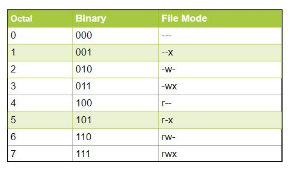

# Ejercicio 01 : TestShell00
## ¿ Qué son los atributos de todas formas ?
## Directorio de entrega: ex01/
- Crea el archivo testShell00 en tu directorio de entrega.
- Encuentra la manera de que tu pantalla muestre lo siguiente (excepto por la línea
de “total 1”):
- Una vez completados los pasos anteriores, ejecuta el siguiente comando para crear
el archivo que debe ser entregado: tar -cf testShell00.tar testShell00.

*NOTA: Se acepta el año en vez de la hora y las XX del total no deben ser tomadas en consideración*

Bueno, aquí se trata de aprender a gestionar los atributos de los archivos, principalmente los permisos y las fechas, así como de comprobar que el peso de los archivos corresponde al número de caracteres que contienen, entre otras cosas.

## Modificar la fechas

El comando para creación de archivos touch con la opción -t permite incluir una nueva cadena de fecha en lugar de la actual, con formato MMDDhhmm (mes, dia, hora, minuto).

Podemos crear el fichero con el comando:

`touch -t '06012342' Shell00`  *NOTA:es posible que la hora no se modifique*

Lo que aparece al principio de la salida del comando ls con la opcion -l (long), corresponde al resultado de la suma de los bloques de datos ocupados por los archivos del directorio: (total XX)

En el enunciado, luego viene un guión al principio de la línea.
Esto indica que se trata de un fichero convencional. Si se tratara de un directorio por ejemplo, habría una d, o una l si se tratara de un enlace (link). Puede haber más cosas, pero con esas tres posibilidades nos basta por el momento. Luego nos encontramos con tres grupos de tres caracteres que representan los permisos.

## Permisos

Los permisos básicos en Unix son lectura (r), escritura (w) y ejecución (x) para cada uno de los usuarios posibles: usuario (user), grupo de trabajo al que pertenece (group) o cuando el usuario no pertenece a ninguno de los anteriores (others). Estos tres grupos quedan abreviados con las letras ugo.
Entonces, cada una de las letras tiene asociados a su vez los tres permisos anteriores, que pueden estar activos o no.

Un tipo de permiso más o menos estandarizado para la mayoría de ficheros podría ser permiso total para el usuario propietario, de lectura y ejecución para el grupo al que el propietario pertenece y de lectura para otros. Es decir, rwxr-xr--

Los permisos también pueden ser representados en notación octal, de forma que el ejemplo anterior quedaría representado por los números 754:

Uno de los comandos usados para la gestión de permisos es chmod (changemode). Así, para atribuir los permisos anteriores podríamos usar la siguiente instrucción:

`chmod 754 <nombreArchivo>`

En el caso que nos ocupa, deberemos asignar permiso de lectura para el usuario actual y de lectura y ejecución tanto para el grupo como para otros. Para unos permisos iniciales rw-r--r--, esto podemos hacerlo usando la notación simbólica (grupos de usuarios) :

`chmod go = rx Shell00`   además de `chmod u - w Shell00`

o bien usando la notación octal más directamente:

`chmod 455 Shell00`

Continuando con la salida de ls -l, a continuación tenemos el número de referencias (o número de nombres que apuntan al mismo inodo*), seguido del usuario propietario, el grupo propietario, el tamaño del fichero en bytes, la fecha de última modificación y el nombre del archivo.

Para terminar, sólamente nos restaría  incluir el número de caracteres pertinente para que el tamaño del fichero fuese el adecuado - en este caso, 40 incluyendo saltos de línea - y comprimir el archivo usando el comando tar de la forma especificada.

Visto lo necesario para realizar el ejercicio sin entrar en muchos detalles, para que el repo sea más ameno incluiré cositas a discreción que me parezcan bien, como fue el caso de la introducción de Mazinger Z en el ejercicio anterior.

En éste, una prueba de que antes de que surgieran conceptos actuales como "transhumanismo", la ética y la moral de una evolución humana excesivamente tecnológica ya fueron magistralmente cuestionados en obras [anime](https://www.youtube.com/watch?v=-u77XdL8_B4) como **Ghost in the Shell**, de 1995.

Una introducción más que sugerente para una obra que todo el mundo podría ver perfectamente y no perderá el tiempo, sobre todo tomando en consideración los tiempos que corren.

*inodo: 

index mode. Estructuras representativas de los archivos, se agrupan en tablas y se identifican por números. El inodo contiene toda la información sobre el archivo, salvo su nombre.
