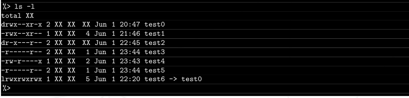

# Ejercicio 02
## Si, quiero más...
## Directorio de entrega ex02/

- Crea los siguientes archivos y directorios. Haz lo que sea necesario para que la
ejecución de un ls -l en tu directorio muestre algo que se parezca a esto:



- Una vez resuelto el ejercicio, ejecuta el comando tar -cf exo2.tar * para crear el archivo que tendrás que entregar.

*NOTA: No importa lo que aparezca en lugar de XX, se acepta un año en lugar de la hora.*

De la misma manera que creamos ficheros con touch, se pueden crear directorios con mkdir (make dir).

En la salida del enunciado, vemos que hay directorios y ficheros con diferente nombre y permisos, además de diferente número de referencias (links). La fecha es lo que se mantiene igual, aunque la hora sea distinta.

## Enlaces

Como vimos en el ejercicio anterior, cada archivo se representa por una estructura llamada inodo. Estos inodos, a su vez,  se agrupan en una tabla y se representan por un número. Los inodos contienen toda la información sobre el archivo, salvo su nombre.

Los datos reales de los archivos se guardan en los bloques de datos, por lo que es fácil dar varios nombres (referencias o enlaces duros) al mismo archivo.

Un enlace duro es una segunda entrada que apunta al mismo inodo, mientras que un enlace simbólico (soft link) es un archivo especial que contiene la ruta del archivo al que apunta, es decir, lo que vendría siendo un acceso directo de microsoft windows, para entendernos.

Según el enunciado, hemos de generar un acceso directo al archivo test0 llamado test6, además de hacer que test3 y test5 apunten al mismo inodo, o dicho de otra forma, crear un enlace duro entre test3 y test5.

El orden apropiado para el ejercicio es crear los directorios y los ficheros con la fecha y nombre adecuados, luego los enlaces y por último establecer los permisos, para no entorpecernos a nosotros mismos privándonos de alguna capacidad de modificación de los ficheros.

```
mkdir test0 test2
touch -t 06010000 test0 test2

```

`touch -t 06010000 test1 test3 test4`

Crearemos el enlace duro primero entre test3 y test5 con el comando ln, que sirve para crear enlaces entre archivos. Sin el uso de opciones, se crean enlaces duros por defecto:

`ln test3 test5`  

aparecerá el fichero test5 con iguales atributos que test3 y dos referencias.

Ahora hacemos un soft link entre test0 y test6 usando ln con la opción -s:

`ln -s test0 test6`

Se crea un fichero tipo link, que es un acceso directo al directorio test0, por defecto con todos los permisos habilitados.

Ahora restaría modificar los permisos como vimos en el ejercicio anterior.

Posteriormente, comprimir los archivos a entregar en un archivo llamado exo2.tar usando el comando del enunciado.

Con el símbolo(*) tras el comando `tar -cf (create file) exo2tar` se incluirán todos los ficheros presentes en el directorio de trabajo actual.
