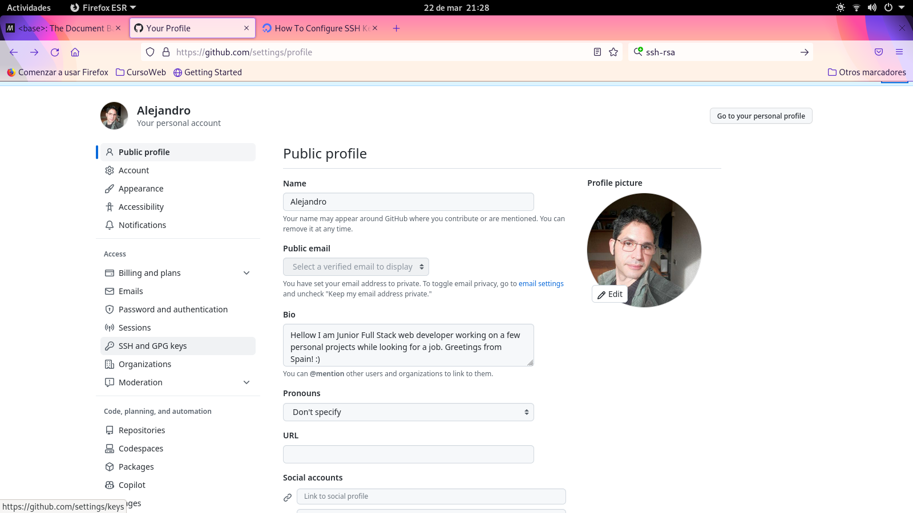

# Ejercicio 03
## Conéctame por SSH...
## Directorio de entrega ex03/

**Crea tu propia clave SSH. Cuando lo tengas:**
- Añade tu clave pública a tu repositorio, en un archivo id_rsa_pub

- Actualiza tu clave ssh en la intranet. Esto te permitirá lanzar el repositorio a
nuestro servidor git.

Bueno esto básicamente viene a ser generar un par de claves ssh con el comando

`ssh-keygen`

Expliqué el proceso en el archivo [readme.md](https://github.com/ehdinayan/C00/blob/master/readme.md) del repositorio C00, de manera que no lo volveré a explicar aquí.

De forma sintetizada, copiar la clave pública en el servidor al cual deseamos tener acceso permite que se identifique en nuestro equipo cliente la contraparte privada de la misma clave, estableciendo así la conexión SSH (Secure Shell).

Las claves pueden ser protegidas por contraseña en el momento de su creación.

Al ser para su uso en GitHub principalmente, habremos de añadir nuestra clave pública en el apartado **SSH and GPG Keys** dentro de settings en nuestro perfil, en el menu de la izqda de la pantalla:

 
