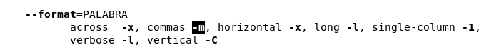
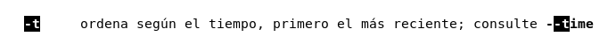

# Ejercicio 04
## midLS
## Directorio de entrega ex04/

## Crea un archivo midLS que contenga el comando que hay que ejecutar para listar los archivos y los directorios del directorio actual, pero no los archivos ocultos, ni "."ni ".."(nada que empiece con un punto), separados por comas, ordenados por fecha de modificación y de tal modo que los directorios vayan seguidos por el carácter slash ("/").

*NOTA: No hay que hacer lo que no se ha pedido! y...RTFM!*

Las opciones para que el comando **ls** muestre los archivos dentro de un directorio **separados por comas, ordenados por fecha de modificación y** en caso de los directorios **con una barra o slash al final son:**

- -m para las comas

- -t para ordenar por fecha de modificación

- -p para añadir un slash en los directorios

Por lo tanto, para ejecutar este ejercicio nos valdremos del comando:

`echo "ls -mtp" > midLS`
