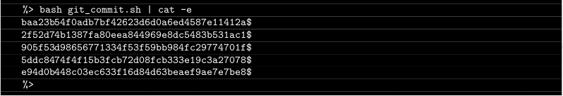

# Ejercicio 05
## ¿ Git commit ?
## Directorio de entrega ex05/
## archivos a entregar: git_commit.sh

- Crea un script de shell que muestre en pantalla los id de los últimos 5 commits de tu repositorio git:

- Para probar tu script, utilizaremos nuestro propio entorno.

*NOTA: RTFM!*

Vale vamos a aclarar un par de cosas antes de hacer el ejercicio, la primera saber que es Shell y que es Bash o qué diferencia hay entre ellos.

Un Shell es un intérprete de línea de comandos que acepta y ejecuta comandos. Si alguna vez has ejecutado algún comando de Linux, entonces has utilizado el Shell. Cuando abres un terminal en Linux, ya estás ejecutando el Shell por defecto de tu sistema.

Bash es la abreviatura de "Bourne-Again Shell”, es sólo un tipo de los muchos Shells disponibles en Linux. Suele ser el Shell por defecto en la mayoría de las distribuciones, por ello, Bash suele ser sinónimo de Shell.

Cuando se hace un fichero.sh ejecutable desde intérprete de comandos, se suele añadir la línea SheBang `#! /bin/bash` al inicio del fichero para indicar que se trata de un script para el Shell Bash. Esto hace que no sea necesario escribir bash delante del nombre del fichero para ejecutarlo.

*fuente: https://itsfoss.com/es/ejecutando-bash-script/*

Si no se escribe la línea SheBang, supongo que aunque haya que escribir bash antes del nombre del fichero, se puede ejecutar el script desde cualquier Shell.

**Entonces se trata de obtener como salida el hash de los últimos 5 commits seguido por el signo $ al final de cada línea.**

El comando para mostrar los logs de git es **git log.**

En mi caso estoy usando el Shell Bash GNU versión 5.1.4 en Debian 11 y este comando me devuelve 4 commits con hash, autor, fecha y mensaje de confirmación, cada cosa en una línea.

A la hora de limitar la salida o adecuarla a nuestras necesidades, tenemos el comando:

`git log --format="%H %ad %an %s" -n5`

donde **%H** es el hash, **%ad** la fecha, **%an** el autor y **%s** el mensaje de confirmación (commit). **-n** se refiere al número de commits que queremos visualizar y lo especificaremos escribiendo el dígito a continuación.

Entonces, para crear nuestro script podemos hacer:

`echo "git log --format='%H' -n5" > git_commit.sh`

Luego podemos añadir la línea SheBang usando cualquier editor si no se desea escribir bash delante del nombre del fichero, por último dar permisos de ejecución para el usuario con `chmod u+x git_commit.sh`

**La opción -e del comando cat** es la que añadirá la marca para los finales de línea a la salida de la ejecución del script.
