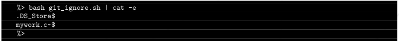
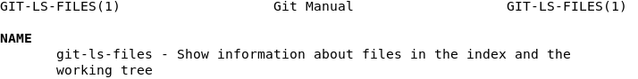
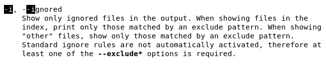
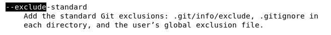

# Ejercicio 06
## Directorio de entrega ex06/
## archivos a entregar: git_ignore.sh

- Crea un script de shell que muestre por pantalla la lista de archivos existentes ignorados por tu repositorio git actualmente presentes en tu repositorio local.
Ejemplo:

- Para probar tu script, usaremos nuestro propio entorno

Tomando en consideración lo dicho en el ejercicio anterior sobre los scripts de Bash, haremos otro que básicamente será un comando de Git.

El comando tiene que mostrar los archivos ignorados por el fichero .gitignore presentes en el directorio actual, por lo que buscaremos un comando relativo a Git con las opciones y sintaxis adecuada para producir ese resultado.

El uso de .gitignore puede ser muy útil por ejemplo a la hora de hacer un tracking mucho más ligero a nuestros proyectos. tal sería el caso de un videojuego en el que estamos haciendo un control de versiones con Git pero a la hora de hacer push a GitHub, no nos interesan todos los ficheros que incluye un proyecto de Unity por ejemplo, sino solamente los scripts.

En esta [página](https://docs.github.com/es/get-started/getting-started-with-git/ignoring-files) hay información útil sobre como y por qué crear un fichero .gitignore, y en [esta](https://github.com/github/gitignore) múltiples plantillas de ficheros .gitignore apropiados para múltiples tipos de lenguajes de programación, proyectos, frameworks, engines, etc...

Podemos encontrar información interesante sobre como listar ficheros con Git en el Git Manual de nuestra distribución:

  

El índice se refiere al índice de Git. Estos son los ficheros que hemos hecho que estén siendo "staged" a través del comando git add.

El árbol de trabajo se refiere a nuestro directorio local:

Como podemos ver en el manual, la opción **-i** nos será útil para ver los archivos ignorados por Git tanto en el índice como en el directorio. También nos avisa de que tendremos que activar otras reglas para el comando en función de la salida que nos interese, haciendo uso del argumento **--exclude.**

Esta opción nos ayudará a mostrar además los ficheros que no estén siendo "staged"

Este argumento indica que deseamos que sean incluidos en la salida también los ficheros pertenecientes a los registros de archivos ignorados por defecto por Git, como pueden ser algún tipo de archivos generados automáticamente, archivos temporales, etc, así como los que tenga configurados el usuario en su archivo de exclusión local si es el caso.

Por lo tanto, para generar nuestro script podremos hacer lo siguiente:

`echo "git ls-files -io --exclude-standard" > git_ignore.sh`

Luego siguiendo las buenas prácticas del ejercicio anterior y creando algunos ficheros o directorios de prueba, podremos comprobar si el script funciona correctamente.

Y ahora me despido con una plácida y agradable [musiquita](https://www.youtube.com/watch?v=86YjnTRo6Rg) de Domingo adiós.
