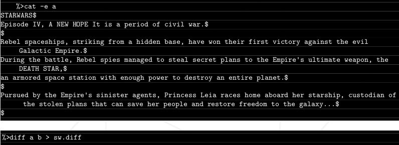
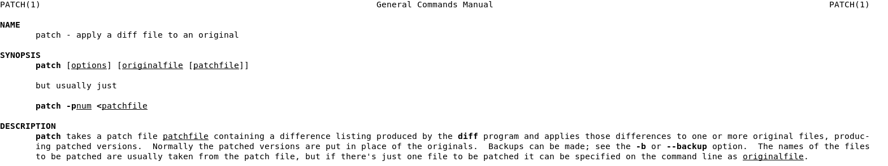
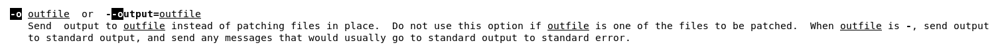

# Ejercicio 07
## Directorio de entrega ex07/
## archivos a entregar: b

- **recursos:** ficheros sw.diff y a

- Crea el archivo b de tal modo que:



- *Ayuda: man patch*

Para comprender bien este ejercicio, es necesario también conocer como trabaja el comando diff, aunque sea sin entrar en muchos detalles.

Uno de los recursos que se nos facilita para el ejercicio es la salida de diff entre a y b. Eso quiere decir que tenemos las siguientes indicaciones respecto a los pasos a llevar a cabo **para que el archivo a sea como el archivo b:**

## Contenido de sw.diff:

```
1,2c1,8
< STARWARS
< Episode IV, A NEW HOPE It is a period of civil war.
---
> Episode V, A NEW H0PE It is a period of civil war
> Rebel spaceships, striking from a hidden base, have won their first victory against the evil Galactic Empire.
> During the battle, Rebel spies managed to steal secret plans to the Empire's ultimate weapon, the STAR DEATH, an armored space station with enough power to destroy an entire planet.
>
>
> Pursued by the Empire's sinister agents,
> Princess Mehdi races home aboard her starship, custodian of the stolen plans that can save her people and restore the dictatorship to the galaxie..
>
4,6d9
< Rebel spaceships, striking from a hidden base, have won their first victory against the evil Galactic Empire.
< During the battle, Rebel spies managed to steal secret plans to the Empire's ultimate weapon, the DEATH STAR,
< an armored space station with enough power to destroy an entire planet.
8d10
< Pursued by the Empire's sinister agents, Princess Leia races home aboard her starship, custodian of the stolen plans that can save her people and restore freedom to the galaxy...
```

¿Qué nos está diciendo aquí la salida de diff?

- `1,2c1,8` **Cambiar** las líneas 1 y 2 del primer archivo por las líneas 1 a 8 del segundo archivo. A continuación se nos muestra las líneas del primer archivo a ser cambiadas precedidas por el signo (<), una separación (---), y luego las líneas 1 a 8 del fichero objetivo, precedidas por el signo (>).

- De igual manera tenemos:`4,6d9`**Borrar (delete)** las lineas 4 a 6 del primer archivo para igualar al fichero objetivo en la linea 9.

- **Borrar (delete)** la línea 8 del primer archivo de forma que se igualen los ficheros en la linea 9.

- Hay otra posibilidad de salida que no aparece pero vale la pena comentar, sería la letra **a** en lugar de la **d** o la **c**, que querría decir **anexar** o poner a continuación.

Muy bien, se nos pide el fichero **b** pero no lo tenemos. Si que tenemos **sw.diff**, que nos dice como tendría que ser **a** para ser igual que **b**. Aqui es donde entra en juego el comando Patch.


## El comando Patch

Siguiendo las indicaciones del enunciado, en el manual vemos una clara descripción del comando patch:



O sea que aplica la salida de un diff a un archivo, de forma que ambos sean iguales. Eso está muy bien, pero no es lo que queremos tampoco. Queremos obtener un archivo sólo con las diferencias entre a y **sw.diff**, al que llamaremos **b** y será el fichero a entregar. No queremos patchear **a.**

Entonces, buscamos una opción que nos permita enviar la salida del patch a un archivo externo, en lugar de sobreescribir el fichero **a** con los cambios:



Efectivamente, la opción -o (outfile) genera un fichero a la ejecución en vez de patchear el archivo original. Esto seria nuestro archivo **b.**

Entonces:

`patch a < sw.diff -o b`

 Hemos patcheado a con sw.diff pero en vez de sobreescribir a, hemos mandado la salida a **b**, generando así el fichero que necesitamos.

 ## Comprobaciones

 Teniendo claro que sw.diff es la salida del comando `diff a b > sw.diff` como se nos indica en el enunciado, **podemos generar un nuevo fichero que contenga las diferencias entre a y nuestro archivo b para compararlo a su vez con el archivo sw.diff...**

 `diff a b > c`

 `diff c sw.diff`

 Si al pulsar enter después del segundo comando volvemos a tener únicamente la línea del prompt, significa que no hay diferencias que mostrar, asi que nuestro fichero b es idéntico al que se utilizó para generar el fichero sw.diff original.

 Y ahora una [musiquita](https://www.youtube.com/watch?v=KQ6zr6kCPj8) veraniega para amenizar...
