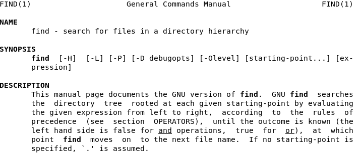
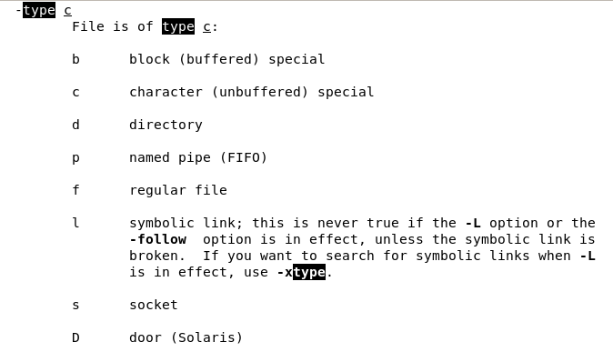
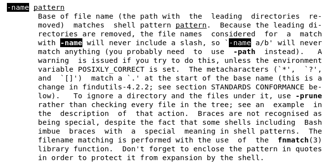
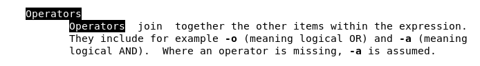

# Ejercicio 08
## Directorio de entrega ex08/
## archivos a entregar: clean

- Escriba en un archivo clean una línea de comandos que busque, a partir del direc-
torio actual y en todos sus subdirectorios, los archivos cuyo nombre se termine por
~, o empiece y se termine por #.

- La línea de comandos mostrará y borrará los archivos encontrados.

- Solo se autoriza un comando: nada de ’;’ , ’&&’ ni otros trucos.

*Ayuda: man find*

Bueno aquí tenemos que componer un comando que después de hacer lo que se le indica (listar unos tipo de archivo específicos) los elimine también.

Así que vamos a ver en primer lugar como siempre el manual de GNU respecto de este comando, que por cierto es de los que más opciones tiene:



En principio se nos indica, entre otras cosas, que el comando busca en jerarquía partiendo del directorio actual mientras no se indica otra cosa.

Nosotros buscamos archivos con unas características concretas en sus nombres, que tendremos que indicar con el uso de expresiones regulares.

- para indicar que buscamos ficheros usaremos la opción `-type f` :



Muy bien, ¿cómo indicaremos que el nombre de los archivos que buscamos tiene que terminar por "~" o bien empezar y acabar por "#"?


- con la expresión `-name "*~" -o -name "#*#"` :





Es importante remarcar que las expresiones regulares **cualquier caracter seguido de ~**
(* ~) y **almohadilla-cualquier caracter-almohadilla**  (#*#) deben ir entrecomilladas.

También necesitaremos acotar las posibilidades de nombres entre paréntesis, para que las acciones posteriores se apliquen a las dos coincidencias o matches y no solo a la última, así:

`\( -name "*~" -o -name "#*#" \)`

## Comprobaciones

Ahora ya tenemos un comando completo que podemos probar, de manera que en mi directorio de usuario local creo una carpeta llamada prueba y unos archivos que servirán de prueba valga la redundancia:

```
alejandro@debian:~$ mkdir prueba

alejandro@debian:~$ cd prueba

alejandro@debian:~/prueba$ touch \#xtrangefile#

alejandro@debian:~/prueba$ touch \#intentfile

alejandro@debian:~/prueba$ touch hellw~ lisfile# newfile otherfile.txt anotherfile.md
```
- Como sólo queremos ver si se listan los archivos correctamente, podemos hacer así:

```
alejandro@debian:~/prueba$ find -type f -name "*~" -o -name "#*#"  
./hellw~
./#xtrangefile#
alejandro@debian:~/prueba$
```

Efectivamente ya vemos que sólo se listan los archivos finalizados por ~ o cuyo nombre se encuentra entre almohadillas. Ahora ya podemos crear el archivo con el comando completo, que será:

`find -type f \( -name "*~" -o -name "#*#" \) -print -delete`

Para amenizar el ejercicio, legendaria [musiquita](https://www.youtube.com/watch?v=oBWvnet50zc) de un par de amigos que en los ochenta siempre [andaban](https://www.youtube.com/watch?v=WwpVWtW6VUs) que buscando algo...Hasta la próx!
