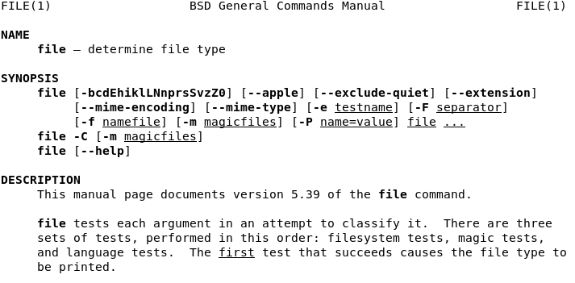

# Ejercicio 09
## Directorio de entrega ex09/
## archivos a entregar: ft_magic

- Crea un archivo mágico que se llame ft_magic que tendrá que estar formateado
correctamente para detectar los archivos de tipo 42 file y constituidos por la
cadena "42" en el byte 42º

## ¿Qué son magic files?

En los sistemas Unix, existen unos ficheros especiales que sirven para identificar un tipo de archivo, independientemente de la extensión del archivo o de su nombre.

Así, por ejemplo hay muchos tipos de archivo con diferentes codificaciones específicas en puntos determinados del fichero que permiten saber al sistema operativo con qué tipo de dato está tratando: un archivo de vídeo, imagen, texto...etc.

En el ejercicio se nos pide que creemos uno de estos archivos para que identifique los archivos de tipo 42 file. ¿Cuales serán éstos archivos?

Como explica el enunciado, **aquellos que contengan el string "42" el el 42º byte**

Esto quiere decir que si generamos un fichero que contenga 41 espacios en la primera línea e inmediatamente en el caracter siguiente empiece el string "42", estaremos ante este tipo de archivo:


## ¿ Y cómo hacemos el magic file ?

Vamos a buscar en el manual con el comando:

`man magic`


El manual hace referencia el patrón de creación del fichero en base a la identificación del comando **file**, así como donde se encuentran ubicados normalmente estos *magic files* dentro de la estructura de archivos del sistema.

En el caso que nos ocupa hay que crear un fichero con un offset inicial que nos interese, (41), seguido del tipo de dato a comprobar (string) y finalmente la frase o mensaje que aparecerá cuando la comprobación sea exitosa:


Los espacios entre los caracteres de la linea son tabuladores, no sé si es imprescindible que sea así para que funcione.


De manera que tendríamos ya nuestro magic file configurado y listo para ser usado con **file:**



Así se aprecia como una de las comprobaciones que lleva a cabo es si el archivo es detectado por algún patrón de *magic file*

## ¿Usaremos alguna opción concreta?

Si, la opción -m:


Es decir, de ésta explicación se deduce que igual es buena cosa compilar nuestro archivo magic primero:


Pero bueno, a mi me ha funcionado ejecutando directamente el comando:

```
alejandro@debian:~/Documentos/Barcelona42/Shell00/ex09$ file -m ft_magic testfile
testfile: 42file
```
Para amenizar el repo, aprovechando que probablemente este año se venga otra entrega de Alien, una escena de la segunda [película.](https://drive.google.com/file/d/1zTp6r287YX8-5Otd9yegp_Ct5WXuXwOZ/view?usp=sharing)

En ella, Ripley, a pesar de haber conseguido salir ilesa de las diabólicas maquinaciones de la compañía y tras una hivernación de más de 50 años, es acusada por la pérdida de la nave.

Creo que esto pasa bastante en el mundo empresarial realmente, cuando se busca un cabeza de turco al que culpar de algo ocasionado por las dudosas acciones de aquellos que tratan de ocultarlas con su acusación...

## Y con esto completo el Shell00 !!
